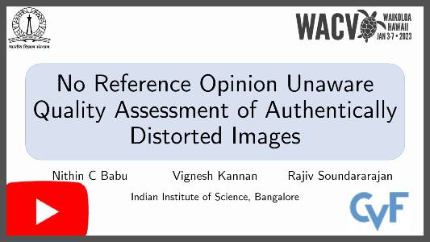
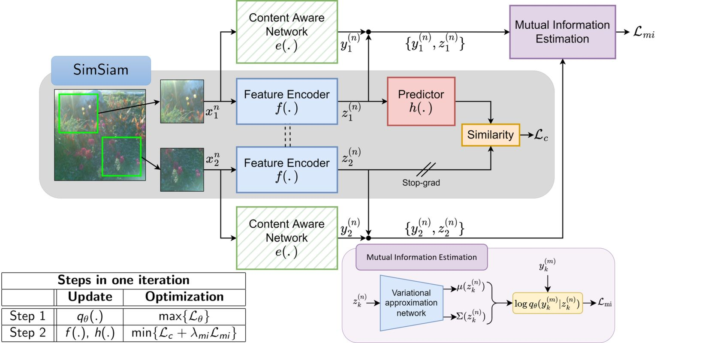

# <p align="center">No Reference Opinion Unaware Quality Assessment of Authentically Distorted Images</p>
<p align="center">
Nithin C. Babu, Vignesh Kannan and Rajiv Soundararajan
</p>

<p align="center">
<a href="https://www.youtube.com/watch?v=Vgw0ithqHxE"></a>
</p>

<p align="center">
<a>Official pytorch implementation of the WACV'23 paper:</a><br>
<a href="https://openaccess.thecvf.com/content/WACV2023/html/Babu_No_Reference_Opinion_Unaware_Quality_Assessment_of_Authentically_Distorted_Images_WACV_2023_paper.html">No Reference Opinion Unaware Quality Assessment of Authentically Distorted Images</a>

</p>



## Performance evaluation
### Pre-trained weights
Google drive link for pre-trained weights:
- [Model pre-trained on synthetic distortions](https://drive.google.com/file/d/1reM8kTgLPBRNZI9fHylrN-nJ1xX0t0pG/view?usp=share_link)
- [Model finetuned on authentic distortions](https://drive.google.com/file/d/1-eXxqqUJSHK8mcKyVPRnL3_RDy6OihSv/view?usp=share_link)

Copy the files to ```./pre_trained_models/``` folder.
### Setting up pristine patches
Google drive link for pre-selected pristine patches [link](https://drive.google.com/file/d/1TV2tHbzqThRNIOFCZp6tZMNryl5Z0bbS/view?usp=share_link). Copy the downloaded file to the ```dataset_images``` folder as ```./dataset_images/pristine_patches_096_0.75_0.80.hdf5``` .

### Testing code
Sample testing code for evaluating the final model on different authentically distorted datasets.
```
python ./evaluate_model.py --dataset LIVEC --model_weights ./pre_trained_models/auth_ft_cd.pth --eval_result_dir ./results/auth_ft_cd/
python ./evaluate_model.py --dataset KONIQ --model_weights ./pre_trained_models/auth_ft_cd.pth --eval_result_dir ./results/auth_ft_cd/
python ./evaluate_model.py --dataset LIVEFB --model_weights ./pre_trained_models/auth_ft_cd.pth --eval_result_dir ./results/auth_ft_cd/
python ./evaluate_model.py --dataset CID --model_weights ./pre_trained_models/auth_ft_cd.pth --eval_result_dir ./results/auth_ft_cd/
```
## Citation
If you find this work useful for your research, please cite our paper:
```
@InProceedings{iqa_content_sep,
    author    = {Babu, Nithin C. and Kannan, Vignesh and Soundararajan, Rajiv},
    title     = {No Reference Opinion Unaware Quality Assessment of Authentically Distorted Images},
    booktitle = {Proceedings of the IEEE/CVF Winter Conference on Applications of Computer Vision (WACV)},
    month     = {January},
    year      = {2023},
    pages     = {2459-2468}
}
```
